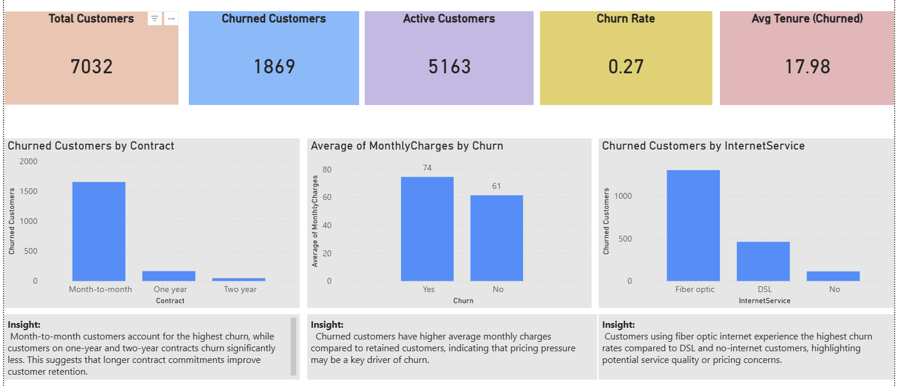

# Customer Churn & Retention Analysis (Telco Dataset)

## 📌 Project Overview
Customer churn is one of the biggest challenges faced by subscription-based businesses.  
This project analyzes customer churn patterns for a telecom company to identify **key drivers of churn** and provide **data-driven retention insights**.

The analysis was performed using **Excel for data preparation and exploratory analysis**, followed by **Power BI for interactive dashboards and KPI tracking**.

---

## 📊 Power BI Dashboard

Below is the interactive Power BI dashboard built to analyze customer churn patterns and key retention drivers.

---

## 🎯 Business Objectives
- Measure overall churn rate
- Identify customer segments with the highest churn
- Analyze the impact of contracts, monthly charges, and internet services on churn
- Provide insights to support customer retention strategies

---

## 🗂 Dataset
- **Source:** Telco Customer Churn dataset  
- **Records:** ~7,000 customers  
- **Key fields:**
  - CustomerID
  - Contract type
  - Monthly Charges
  - Tenure
  - Internet Service
  - Churn (Yes / No)

Cleaned dataset is available in the `/data` folder.

---

## 🧹 Data Cleaning & Preparation (Excel)
Steps performed in Excel:
- Removed duplicates and invalid records
- Ensured correct data types for numerical and categorical fields
- Validated churn labels (Yes / No)
- Created KPI calculations:
  - Total Customers
  - Churned Customers
  - Active Customers
  - Churn Rate
  - Average Tenure of Churned Customers
- Built pivot tables to analyze churn by:
  - Contract type
  - Monthly charges
  - Internet service

---

## 📊 Power BI Dashboard
An interactive Power BI dashboard was created to visualize churn patterns and KPIs.

### Key KPIs:
- Total Customers
- Churned Customers
- Active Customers
- Churn Rate
- Average Tenure (Churned Customers)

### Key Visuals:
- **Churned Customers by Contract**
- **Churn vs Monthly Charges**
- **Churn by Internet Service**

Dashboard file is available in the `/dashboard` folder.

---

## 🔍 Key Insights
- Customers on **month-to-month contracts** have the highest churn rate
- **Higher monthly charges** are strongly associated with churn
- **Fiber optic internet users** churn more compared to DSL users
- Churned customers typically have **shorter tenure**, indicating early disengagement

---

## 💡 Business Recommendations
- Encourage long-term contracts through discounts or loyalty incentives
- Review pricing strategy for high monthly charge segments
- Improve service quality and support for fiber optic customers
- Introduce early engagement programs for new customers

---

## 🛠 Tools Used
- **Excel** — Data cleaning, KPI calculations, pivot tables
- **Power BI** — Data modeling, DAX measures, interactive dashboards
- **GitHub** — Version control and portfolio presentation

---

## 📁 Repository Structure

---

## 👤 Author
**Chibuike Henry Igwebuike**  
Aspiring Data Analyst  
